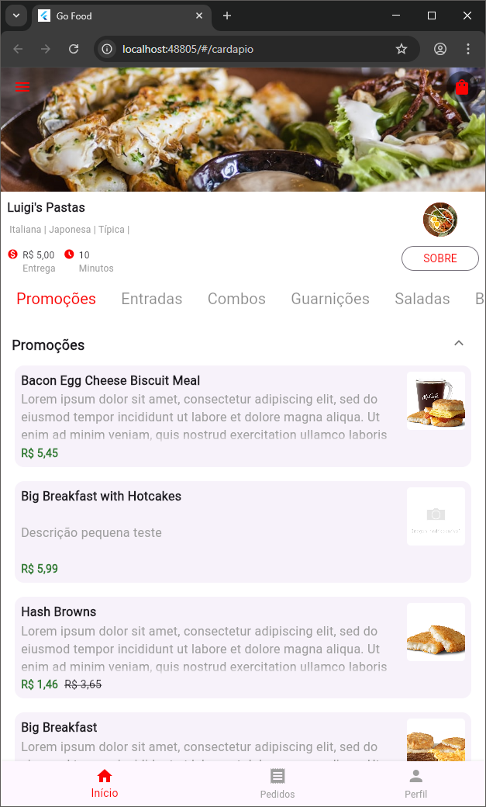
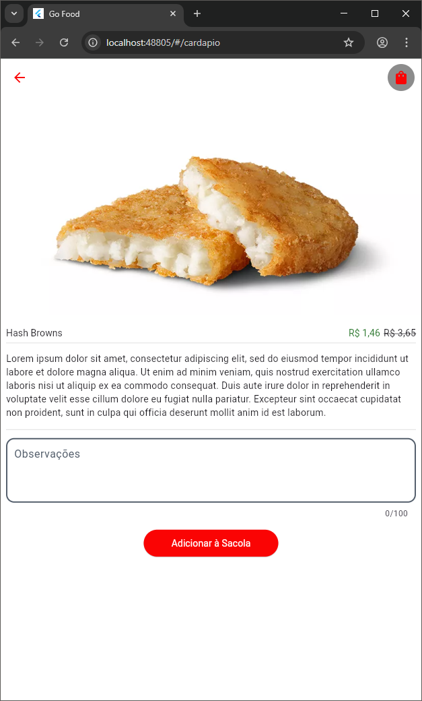
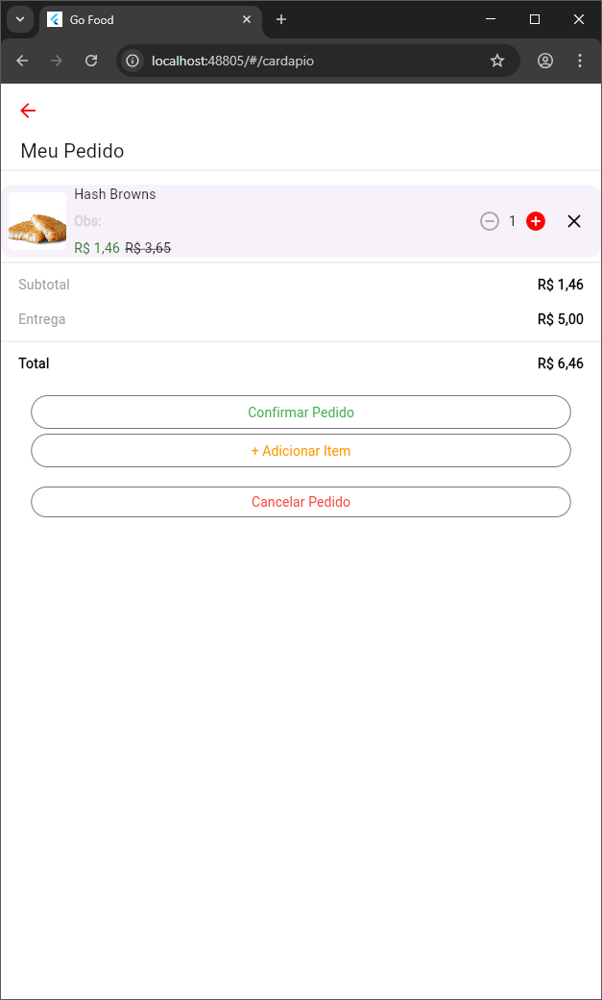

# Go Food

**Go Food** is a web-based digital menu application for restaurants, developed with **Flutter** and **Node.js** REST API.

This project aims to simulate the experience of digital ordering platforms like iFood or Uber Eats, but focused on a lightweight, customizable solution for individual businesses.

---

## Technologies

- Flutter (Web)
- Node.js REST API (Located inside the repository under `restaurante-rest-api`)
- State management: `Provider`, `MobX`
- HTTP requests: `http` package
- UI utilities: `Expandable`, `Badges`
- JSON handling: `json_serializable`, `json_annotation`

---

## Features

- Digital menu display with product categories
- Shopping bag to add items
- Place orders
- Order list
- Responsive design for desktop and mobile

---

## Getting Started

### Requirements

- [Flutter SDK](https://docs.flutter.dev/get-started/install)
- [Node.js](https://nodejs.org/)

### Steps

1. Clone the repository
2. Open a terminal in the `restaurante-rest-api` folder:

   ```bash
   npm install
   npm run start
   ```

   The API will run on http://localhost:3000

3. In another terminal, go to the go-food folder:

   ```bash
   flutter pub get
   flutter run -d chrome
   ```

## Screenshots

<p align="center">
  <br>
  <i>Menu view with product categories</i>
</p>

<p align="center">
  <br>
  <i>Product detail and add to cart</i>
</p>

<p align="center">
  <br>
  <i>Shopping bag and order summary</i>
</p>

## Project Status

- The project works locally, but as the API is not deployed to the cloud, it's mostly a mock/demo environment.
- It is intended as a portfolio project to demonstrate Flutter Web development skills and API integration.

## Future Improvements

- API hosting

- Authentication

- Improved mobile responsiveness

- Better cart and checkout flow

- Change restaurant by passing an `id` in the URL

- Multiple Languages

## License

This project is for study and portfolio purposes.
